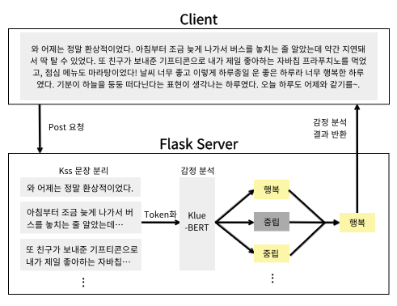

# KoBERT를 이용한 일기 감정 분석 웹 서비스 개발: 감정 팔레트  
**Sentiment Analysis Web Application Development Using BERT: Emotion Palette**  
**한국외국어대학교 바이오메디컬공학부 캡스톤 프로젝트**  

## &#128221; 프로젝트 소개

## &#128101; 팀 소개

<table>
  <tr>
    <td></td>
    <td>
      <table>
        <tr>
          <th>구성원</th>
          <th>할 일</th>
        </tr>
        <tr>
          <td>황지현</td>
          <td>- UI/UX 디자인 - 프론트엔드 구현 - 대화 데이터셋 구축 및 모델 학습</td>
        </tr>
        <tr>
          <td>여언주</td>
          <td>- DB 구축 및 백엔드 구현 - 모델 추론 결과를 반환하는 API 구축 - 대화 데이터셋 구축 및 모델 학습</td>
        </tr>
      </table>
    </td>
  </tr>
</table>

## &#128197; 프로젝트 진행 기간
**2023.09 - 2023.12 (3개월)**

## &#128187; 기능 소개
### 화면 구성
 

  
### 1. 로그인, 회원가입 및 일기 저장 기능
### 2. 감정 분석 알고리즘 구현

   
### 3. 감정별 일기 필터링 기능 및 월별 감정 통계 제공
 

### Pretrained BERT Model
- [KcELECTRA_base](https://github.com/Beomi/KcELECTRA)
- [KcBERT_base](https://github.com/Beomi/KcBERT)
- [KlueRoberta_small](https://huggingface.co/klue/roberta-small)
- [KlueRoberta_base](https://huggingface.co/klue/roberta-base)
- [KlueBERT_base](https://huggingface.co/klue/bert-base)

다양한 한국어 코퍼스에 대해 사전 훈련된 다섯 가지 모델을 선정하여 모델의 감정 분석에 대한 성능을 비교  
정확도가 0.850로 가장 높았던 **KlueBERT-base**을 최종 모델로 선정  
  

  
## &#128736; Skills

## &#127910; 시연
추가 예정
